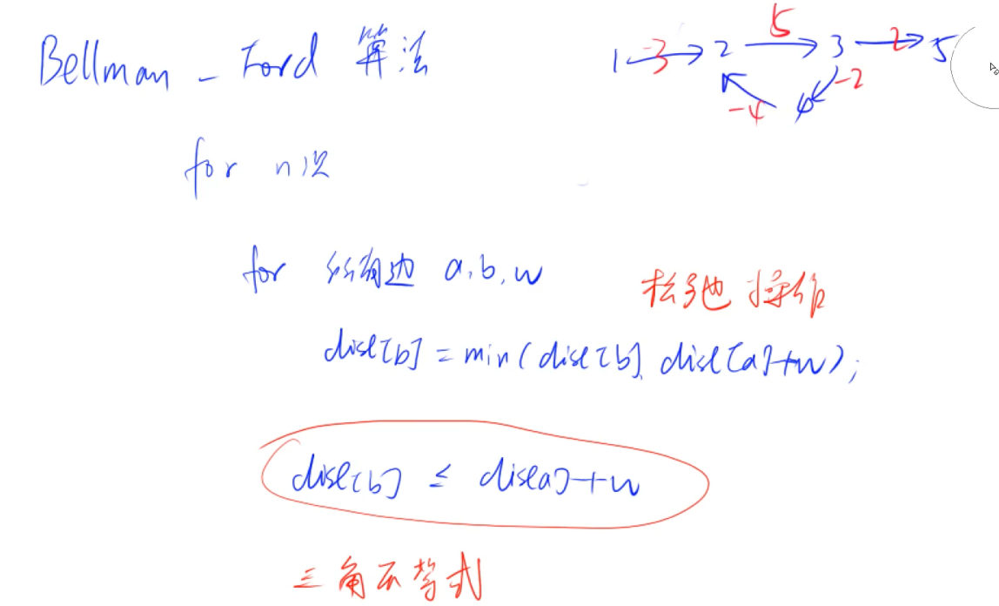

n: 节点数

m: 边数

Dijkstra：基于贪心 	Floyd：基于动态规划		Bellman-Ford：离散数学

## 1. 朴素Dijkstra

## 2. 堆优化的Dijkstra

## 3. Bellman-Ford

不能有负权回路。

第一个外层循环n = k时，dist[]的意义：从起点出发，经过不超过k条边的最短距离。

 可以用来求是否有负环（如果第n次循环有更新，说明从起点经过了n条边，也就是有n+1个点，所以路径中必有重复的点，说明存在负环）:但是时间复杂度高，一般用SPFA来求。

